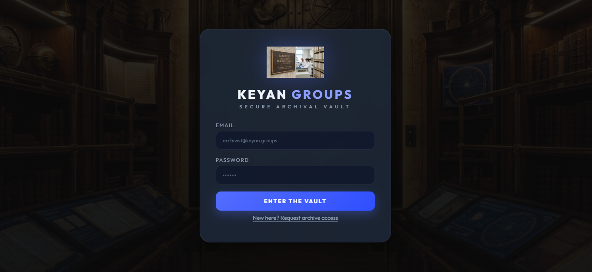
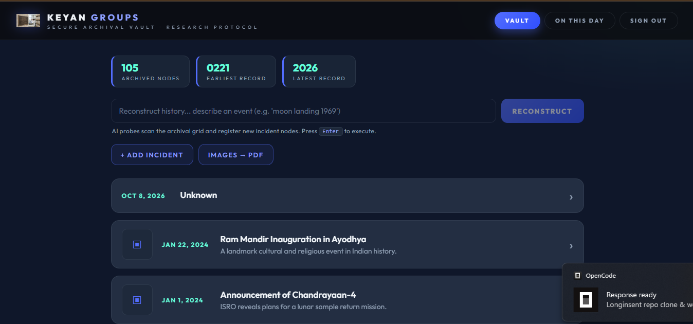
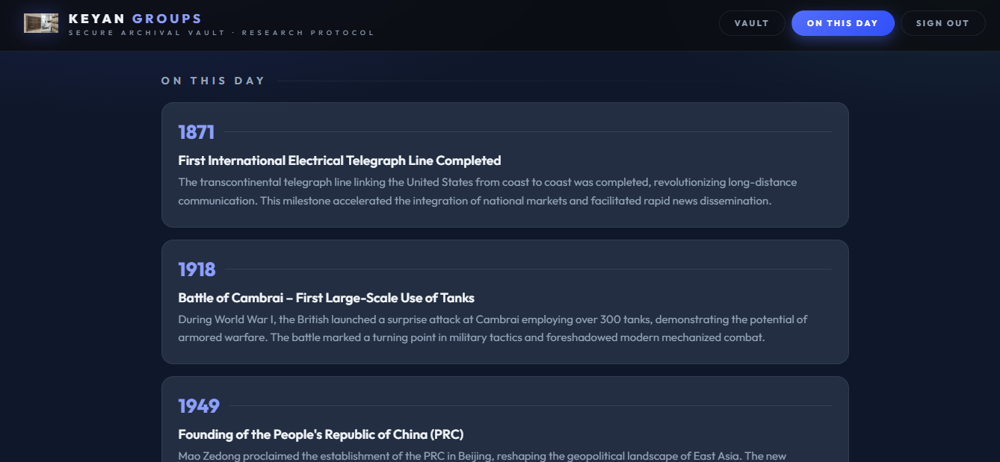

# Longinset — Keyan Groups Archival Vault

> AI-powered historical research vault. Reconstruct history with AI, archive incidents, read deep-dive reports, and export watermark-stamped PDFs — on mobile, desktop, and the web.

Originally built as a **Flutter** app, this repository now ships both the Flutter client (`lib/`) and a production **React web app** (`webapp/`) ready for Vercel.

## Features

| Feature | Description |
|---|---|
| **Secure auth** | Email/password signup & login via Supabase (RLS-protected) |
| **Reconstruct History** | Type any historical query — AI researches it, structures it (title/date/summary), and registers a new incident node in the vault |
| **Deep-dive reports** | Tap any incident → AI generates a full markdown report: timeline, global significance, and 3 archival secrets |
| **PDF export** | Every report exports as an A4 PDF with the *Keyan ARTS* watermark, page numbers, and author credits |
| **Images → PDF** | Pick photos/scans and convert them into a watermarked archival PDF |
| **On This Day** | 5 major historical events from this date, fetched live from the AI |
| **103 seeded incidents** | Curated historical dataset loaded from `historical_vault_data.csv` |
| **Study-first UI** | Dark Slate/indigo theme (Outfit font), vault stats strip, animated timeline cards |

## Screenshots

<p align="center">
  
  <br/>
  <sub><b>Fig 1.</b> Secure archive access — email signup and login with Supabase, styled with the Keyan Groups plaque on the native-splash backdrop.</sub>
</p>

<p align="center">
  
  <br/>
  <sub><b>Fig 2.</b> The Vault — study-stats strip, AI "Reconstruct History" search, and 103 archived incident nodes ready for deep-dive reports.</sub>
</p>

<p align="center">
  
  <br/>
  <sub><b>Fig 3.</b> On This Day — five major historical events from today's date, reconstructed live by the AI.</sub>
</p>

## Repository layout

```
Longinsent/
├── lib/                  # Flutter app (original)
│   ├── main.dart         #   auth, vault, search, deep-dive, PDF
│   ├── features/         #   current_affairs, image→pdf
│   └── services/         #   Groq AI service
├── webapp/               # React web app (Vite)
│   ├── src/              #   pages, components, PDF + Supabase libs
│   ├── server/           #   Express dev proxy (npm run dev)
│   ├── api/              #   Vercel serverless functions (AI endpoints)
│   ├── scripts/          #   seed + debug tools
│   └── vercel.json       #   Vercel build config
├── assets/               # logo plaque, vault/lab backgrounds
└── historical_vault_data.csv  # 103-incident seed dataset
```

## Tech stack

- **Frontend:** React 18 + Vite, `react-markdown`, `jsPDF`, Outfit (Google Fonts)
- **Backend:** Supabase (Postgres + Auth + RLS), Groq AI (`openai/gpt-oss-120b`) behind a thin proxy
- **Mobile:** Flutter / Dart (`supabase_flutter`, `pdf`, `printing`)
- **Deploy:** Vercel (static frontend + `api/` serverless functions)

## Quick start (web)

```bash
cd webapp
npm install
cp .env.example .env      # then fill in your keys (see below)
npm run seed              # load 103 incidents into Supabase
npm run dev               # http://localhost:5173
```

### 1. Supabase (free)

Create a project at [supabase.com](https://supabase.com), then run in the SQL Editor:

```sql
create table incidents (
  id bigint generated by default as identity primary key,
  title text not null,
  description text,
  incident_date date,
  image_url text,
  created_at timestamptz default now()
);
alter table incidents enable row level security;
create policy "public read" on incidents for select using (true);
create policy "public insert" on incidents for insert with check (true);
create policy "public delete" on incidents for delete using (true);
```

Copy **Project URL** + **anon/publishable key** into `.env`.

### 2. Groq (free)

Create an API key at [console.groq.com](https://console.groq.com) → API Keys, and put it in `.env` as `GROQ_API_KEY`.

> The Groq key is **server-side only** — it is read by `server/` (dev) and `api/` (Vercel). Never commit it, and never ship it to the browser.

### `.env`

```bash
VITE_SUPABASE_URL=https://YOUR_PROJECT.supabase.co
VITE_SUPABASE_ANON_KEY=YOUR_ANON_KEY
GROQ_API_KEY=gsk_YOUR_KEY
PORT=3001                    # local dev only
```

## Deploy to Vercel

1. Import this repo → set **Root Directory = `webapp`**
2. Add the three env vars above in **Settings → Environment Variables** (VITE vars are required at *build* time — redeploy after adding)
3. Deploy — `webapp/api/*.js` automatically become the `/api/*` serverless endpoints
4. In Supabase → Authentication → URL Configuration: set **Site URL** to your Vercel domain and add `https://*.vercel.app` + `http://localhost:5173/*` as Redirect URLs

## Flutter app

```bash
flutter pub get
# put your Supabase + Groq keys in lib/main.dart and lib/services/archive_service.dart
flutter run
```

## Security notes

- RLS policies restrict the `incidents` table to select/insert/delete only — no update, no data exposure beyond the vault
- AI keys stay behind the proxy; the browser only ever talks to `/api/*` and Supabase with the public anon key
- Supabase email templates can be re-branded under Authentication → Email Templates

## Credits

- Developed by **Karthikeyan S** — [karthikeyans2006.github.io](https://karthikeyans2006.github.io/)
- GitHub: [KarthikeyanS2006](https://github.com/KarthikeyanS2006/)
- Reports generated by *Keyan Groups AI Protocol*
